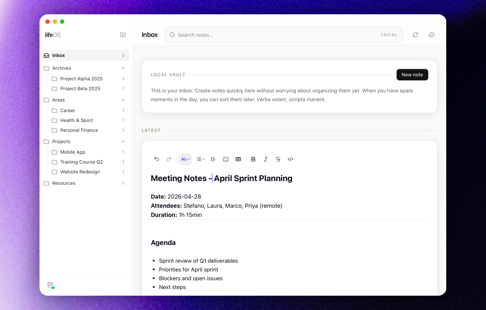

# lifeOS



> 🚧 WORK IN PROGRESS 🚧
>
> This project started only a few days ago.
> The direction is real, but the product is still very early, unstable, and changing fast.

lifeOS is a local-first knowledge and personal operating system evolving toward a desktop-first notes and tracking app.

## Product Direction

lifeOS is meant to go beyond plain note-taking:

- structured templates
- personal databases like expenses, films, and other tracked entities
- custom views
- local-first speed
- future mobile support

The goal is to build something much richer than a notes app while keeping the product open and user-friendly.

## Architecture In Progress

The product direction is clear, but some core architecture decisions are still open.

Right now I am evaluating tradeoffs between:

- Markdown/filesystem-first
- local DB-first with Markdown import/export
- DB-first plus cloud sync later
- hybrid approaches between those models

If you have strong opinions or relevant experience, feedback is very welcome in this thread:

https://www.reddit.com/r/selfhosted/comments/1sxjt19/im_building_the_best_lifeos_app_based_but_im/

The current direction is:

- user-selected local vault
- Markdown files as canonical note storage
- TipTap as the main editor
- Tauri as the desktop shell
- future SQLite indexing layer for speed, search, and structured views

Current local architecture in one sentence:

- Markdown files are the source of truth, while a local SQLite index is rebuilt and queried for fast search, metadata lookup, and future structured views.

This is no longer a plain Vite starter and no longer a backend-first notes client.

## Current Status

Implemented today:

- Tauri desktop shell
- open local folder as vault
- recursive vault scan for folders and `.md` files
- local document create/read/save/delete flows
- in-app folder and file rename/move flows
- sidebar drag and drop for folders
- TipTap to Markdown round-trip
- YAML frontmatter preservation
- SQLite local index for search
- folder mentions persisted as wikilinks like `[[Projects/Alpha]]`
- mention propagation on folder rename/move
- custom macOS overlay titlebar with draggable app chrome

Planned next:

- template registry outside the vault
- attachment import/copy flow
- document-to-document linking model
- richer structured views and stats

The working roadmap lives in [docs/desktop-filesystem-roadmap.md](docs/desktop-filesystem-roadmap.md).
A proper project changelog should be added soon as the pace of UI and architecture changes increases.

## Tech Stack

- React
- TypeScript
- Vite
- TipTap
- Zustand
- Tauri 2
- Rust

## Development

### Requirements

- Node.js
- npm
- Rust toolchain via `rustup`
- Xcode Command Line Tools on macOS

### Install

```bash
npm install
```

### Run the web app only

```bash
npm run dev
```

### Run the desktop app

```bash
npm run tauri:dev
```

### Build

```bash
npm run build
```

### Rust tests for the vault layer

```bash
npm run test:rust
```

## Repository Notes

- `.env` files are local-only and should not be committed.
- Vault content is not stored in this repository.
- Editor/assistant instruction files are ignored for future commits where possible.
